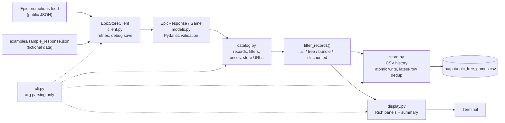

# Architecture

Source for `assets/architecture.svg`. Keep both in sync when the
module layout changes.

```mermaid
flowchart LR
    Feed["Epic promotions feed<br/>(public JSON)"] --> Client
    Sample["examples/sample_response.json<br/>(fictional data)"] --> Client
    Client["EpicStoreClient<br/>client.py<br/>retries, debug save"] --> Models
    Models["EpicResponse / Game<br/>models.py<br/>Pydantic validation"] --> Catalog
    Catalog["catalog.py<br/>records, filters,<br/>prices, store URLs"] --> Filter
    Filter["filter_records()<br/>all / free / bundle / discounted"] --> Store
    Filter --> Display
    Store["store.py<br/>CSV history<br/>atomic write, latest-row dedup"] --> CSV[("output/epic_free_games.csv")]
    Display["display.py<br/>Rich panels + summary"] --> Terminal["Terminal"]
    CLI["cli.py<br/>arg parsing only"] -.-> Client
    CLI -.-> Catalog
    CLI -.-> Store
    CLI -.-> Display
```
